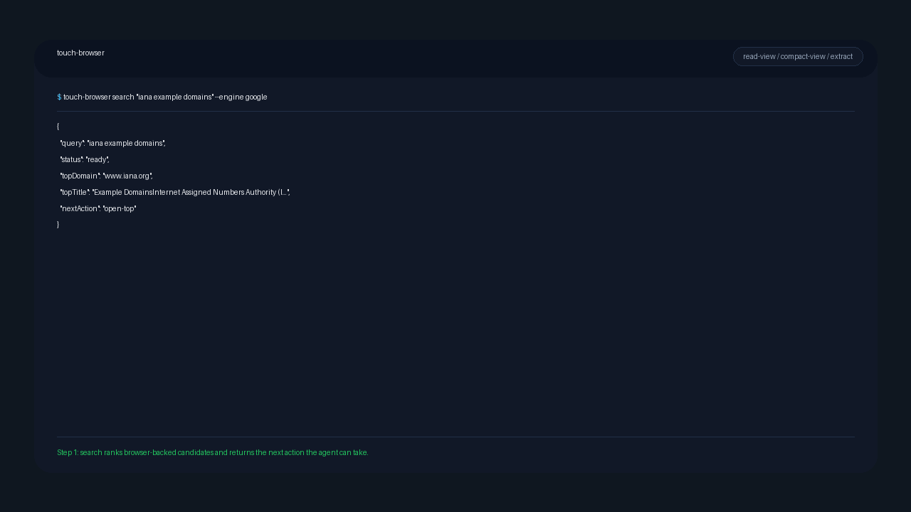

# touch-browser



[](LICENSE)
[](doc/RELEASE_READINESS_SPEC.md)

Turn any web page into structured, citable evidence for AI agents.

`touch-browser` turns a page into:

- search results structured inside the browser with `search`
- readable Markdown for higher-level review with `read-view`
- compact semantic state for agent loops with `compact-view`
- traceable evidence with citations, four-state claim outcomes, and optional verifier adjudication
- replayable, policy-gated browser sessions for multi-page research

Use it when you need:

- source-linked evidence instead of raw HTML dumps
- low-token page state for agent loops
- browser-backed research sessions you can replay and audit
- policy-gated interaction instead of blind automation

Evidence-first, not fact-final:

- `touch-browser` helps an AI collect evidence and trace where it came from.
- A higher-level model or human still decides what is true.

## 30-Second Quick Start

Prerequisites: [rustup](https://rustup.rs), Node.js 18+, `pnpm`.

```bash
bash scripts/bootstrap-local.sh

# Read a public page
cargo run -q -p touch-browser-cli -- read-view https://www.iana.org/help/example-domains

# Produce the low-token agent view
cargo run -q -p touch-browser-cli -- compact-view https://www.iana.org/help/example-domains

# Extract source-linked evidence from the same page
cargo run -q -p touch-browser-cli -- extract https://www.iana.org/help/example-domains \
  --claim "As described in RFC 2606 and RFC 6761, a number of domains such as example.com and example.org are maintained for documentation purposes."
```

If you already built the binary, replace `cargo run -q -p touch-browser-cli --` with `touch-browser`.

`bootstrap-local.sh` installs the default semantic models under:
- `~/.touch-browser/models/evidence/embedding`
- `~/.touch-browser/models/evidence/nli`

Use `TOUCH_BROWSER_EVIDENCE_EMBEDDING_MODEL_PATH` or `TOUCH_BROWSER_EVIDENCE_NLI_MODEL_PATH`
only when you need to override those default locations.

## What It Solves

| Problem | touch-browser |
| --- | --- |
| Agents still need to find the right page | `search` structures ranked browser results for follow-up browsing |
| Raw HTML wastes tokens | `compact-view` emits compact semantic state instead of a full DOM dump |
| Answers lose their sources | `extract` returns block refs plus URL, retrieved time, and source metadata |
| Risky clicks should stay supervised | policy reports and supervised actions keep auth/write flows review-gated |
| Multi-page research is hard to audit | session synthesis keeps visited URLs, notes, citations, and replayable traces |

## Core Commands

| Command | What it does |
| --- | --- |
| `search` | structure ranked browser search results for follow-up browsing |
| `open` | open a target and compile a structured snapshot |
| `read-view` | emit readable Markdown for review |
| `compact-view` | emit the compact semantic view for agent loops |
| `extract` | return claim outcomes with citations |
| `session-synthesize` | combine multi-page session evidence into JSON or Markdown |
| `serve` | expose the runtime over stdio JSON-RPC |

The full command table lives in [doc/CLI_SURFACE_SPEC.md](doc/CLI_SURFACE_SPEC.md).

## Architecture

```text
Query / URL / fixture / browser tab
  -> browser-first search result parsing
  -> Acquisition
  -> Observation compiler
  -> read-view / compact-view
  -> extract (evidence + citations + optional verifier)
  -> policy
  -> session synthesis / replay
  -> CLI / JSON-RPC serve / MCP
```

## MCP Example

Minimal MCP bridge setup from the repository root:

```json
{
  "mcpServers": {
    "touch-browser": {
      "command": "node",
      "args": ["integrations/mcp/bridge/index.mjs"]
    }
  }
}
```

The bridge starts `touch-browser serve` underneath and exposes tools like `tb_search`, `tb_search_open_top`, `tb_open`, `tb_read_view`, `tb_extract`, `tb_tab_open`, and `tb_session_synthesize`.
By default the bridge prefers an explicit `TOUCH_BROWSER_SERVE_COMMAND`, then a packaged or installed `touch-browser` binary, and only falls back to `cargo run -q -p touch-browser-cli -- serve` when no binary is available.
Use `TOUCH_BROWSER_SERVE_COMMAND` if you want to force a specific built binary or wrapper command.
`tb_read_view` accepts `mainOnly`, `tb_extract` accepts `verifierCommand`, and `tb_search` returns ranked results plus `nextActionHints` with `actor`, `canAutoRun`, and `headedRequired`.

Core serve methods map to MCP tools like this:

| serve JSON-RPC | MCP tool |
|---|---|
| `runtime.open` | `tb_open` |
| `runtime.readView` | `tb_read_view` |
| `runtime.extract` | `tb_extract` |
| `runtime.search` | `tb_search` |
| `runtime.search.openTop` | `tb_search_open_top` |
| `runtime.session.open` | `tb_tab_open` |
| `runtime.session.synthesize` | `tb_session_synthesize` |

Search capture note:

- search identity stabilization is only applied to search-specific browser flows
- it reduces browser-exposed automation markers enough to keep search result pages readable
- it is not presented as a general stealth automation layer for arbitrary browsing, auth, or write flows

Evidence output note:

- `supportSnippets` returns short evidence text for the selected support blocks
- `verdictExplanation` summarizes why the verdict landed where it did
- `confidenceBand` and `reviewRecommended` distinguish strong support from borderline support
- `matchSignals` exposes the first support block's lexical, contextual, numeric, semantic, and NLI-side matching signals when available
- `evidence-supported + confidenceBand=high + reviewRecommended=false` is the intended direct-reuse path in pilot domains
- `reviewRecommended=true` or `confidenceBand=review` means the next step should be `--verifier-command` or another page, not blind reuse

## Docs And Proof

- operations: [doc/INSTALL_AND_OPERATIONS.md](doc/INSTALL_AND_OPERATIONS.md)
- command surface: [doc/CLI_SURFACE_SPEC.md](doc/CLI_SURFACE_SPEC.md)
- architecture: [core/crates/cli/ARCHITECTURE.md](core/crates/cli/ARCHITECTURE.md)
- examples: [examples/README.md](examples/README.md)
- integrations: [integrations/README.md](integrations/README.md)
- benchmarks and positioning: [doc/README.md](doc/README.md)
- pilot and operations package: [doc/PILOT_PACKAGE_SPEC.md](doc/PILOT_PACKAGE_SPEC.md), [doc/OPERATIONS_SECURITY_PACKAGE_SPEC.md](doc/OPERATIONS_SECURITY_PACKAGE_SPEC.md)

## License

This repository now uses `MPL-2.0`.

- commercial and non-commercial use are allowed
- if you distribute modified MPL-covered files, those covered files stay under `MPL-2.0`
- separate files in a larger work can use different terms
- full legal text: [LICENSE](LICENSE)
- plain-language policy: [LICENSE-POLICY.md](LICENSE-POLICY.md)
